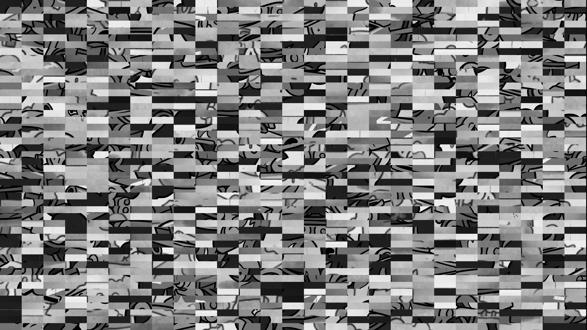
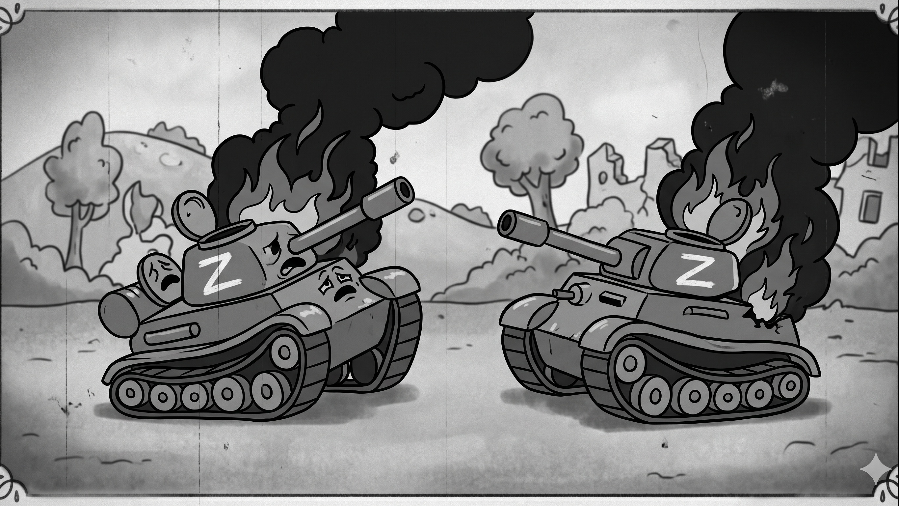

# Лаб.1 - Шифратор для дронів. Дешевий варіант захисту аналогового відео

Суть проста: є генератор псевдовипадкової послідовності (16-бітний [Linear Feedback Shift Register](https://uk.wikipedia.org/wiki/%D0%A0%D0%B5%D0%B3%D1%96%D1%81%D1%82%D1%80_%D0%B7%D1%81%D1%83%D0%B2%D1%83_%D0%B7_%D0%BB%D1%96%D0%BD%D1%96%D0%B9%D0%BD%D0%B8%D0%BC_%D0%B7%D0%B2%D0%BE%D1%80%D0%BE%D1%82%D0%BD%D0%B8%D0%BC_%D0%B7%D0%B2%27%D1%8F%D0%B7%D0%BA%D0%BE%D0%BC) з поліномом максимальної довжини) який створює потік чисел, далі за допомогою алгоритму [Фішера-Єйтса](https://uk.wikipedia.org/wiki/%D0%A2%D0%B0%D1%81%D1%83%D0%B2%D0%B0%D0%BD%D0%BD%D1%8F_%D0%A4%D1%96%D1%88%D0%B5%D1%80%D0%B0_%E2%80%94_%D0%84%D0%B9%D1%82%D1%81%D0%B0) створюється таблиця перестановок, після чого зображення розбивається на сітку блоків та перемішується згідно таблиці.

```
# python3 lab01/lab01.py

Сід:                     12345
Зашифроване зображення:  /home/pvlrmnnk/kpi-ms-crypto/lab01/encrypted.jpg
Розшифроване зображення: /home/pvlrmnnk/kpi-ms-crypto/lab01/decrypted.jpg
```

---
Оригінал:


Зашифроване зображення:


Розшифроване зображення

